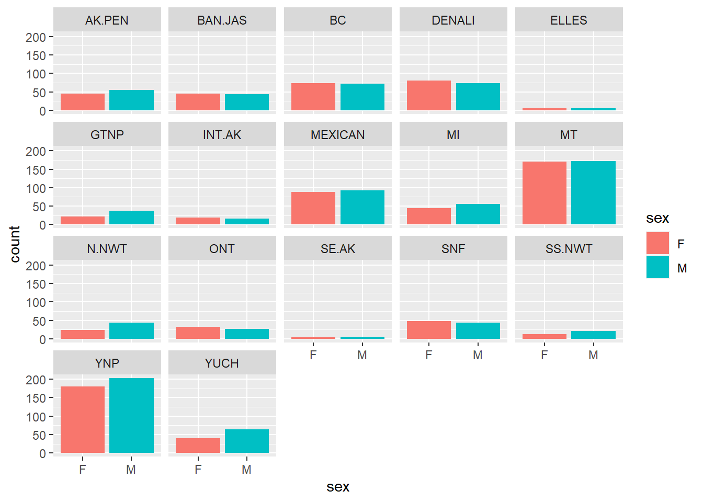

## Load the Libraries  

```r
library(tidyverse)
```

```
## ── Attaching packages ─────────────────────────────────────── tidyverse 1.3.2 ──
## ✔ ggplot2 3.4.0      ✔ purrr   1.0.0 
## ✔ tibble  3.1.8      ✔ dplyr   1.0.10
## ✔ tidyr   1.2.1      ✔ stringr 1.5.0 
## ✔ readr   2.1.3      ✔ forcats 0.5.2 
## ── Conflicts ────────────────────────────────────────── tidyverse_conflicts() ──
## ✖ dplyr::filter() masks stats::filter()
## ✖ dplyr::lag()    masks stats::lag()
```

```r
library(shiny)
library(shinydashboard)
```

```
## 
## Attaching package: 'shinydashboard'
## 
## The following object is masked from 'package:graphics':
## 
##     box
```

```r
require(janitor)
```

```
## Loading required package: janitor
## 
## Attaching package: 'janitor'
## 
## The following objects are masked from 'package:stats':
## 
##     chisq.test, fisher.test
```

```r
library(palmerpenguins)
```

## Practice
Let's try to build an app that allows users to explore sexual composition of wolf packs by `pop`. These data are from: Brandell, Ellen E (2021), Serological dataset and R code for: Patterns and processes of pathogen exposure in gray wolves across North America, Dryad, [Dataset](https://doi.org/10.5061/dryad.5hqbzkh51)  

1. Start by loading and exploring the data.

```r
wolves <- read_csv("data/wolves_data/wolves_dataset.csv")
```

```
## Rows: 1986 Columns: 23
## ── Column specification ────────────────────────────────────────────────────────
## Delimiter: ","
## chr  (4): pop, age.cat, sex, color
## dbl (19): year, lat, long, habitat, human, pop.density, pack.size, standard....
## 
## ℹ Use `spec()` to retrieve the full column specification for this data.
## ℹ Specify the column types or set `show_col_types = FALSE` to quiet this message.
```


```r
names(wolves)
```

```
##  [1] "pop"                "year"               "age.cat"           
##  [4] "sex"                "color"              "lat"               
##  [7] "long"               "habitat"            "human"             
## [10] "pop.density"        "pack.size"          "standard.habitat"  
## [13] "standard.human"     "standard.pop"       "standard.packsize" 
## [16] "standard.latitude"  "standard.longitude" "cav.binary"        
## [19] "cdv.binary"         "cpv.binary"         "chv.binary"        
## [22] "neo.binary"         "toxo.binary"
```


```r
wolves
```

```
## # A tibble: 1,986 × 23
##    pop     year age.cat sex   color   lat  long habitat human pop.dens…¹ pack.…²
##    <chr>  <dbl> <chr>   <chr> <chr> <dbl> <dbl>   <dbl> <dbl>      <dbl>   <dbl>
##  1 AK.PEN  2006 S       F     G      57.0 -158.    254.  10.4          8    8.78
##  2 AK.PEN  2006 S       M     G      57.0 -158.    254.  10.4          8    8.78
##  3 AK.PEN  2006 A       F     G      57.0 -158.    254.  10.4          8    8.78
##  4 AK.PEN  2006 S       M     B      57.0 -158.    254.  10.4          8    8.78
##  5 AK.PEN  2006 A       M     B      57.0 -158.    254.  10.4          8    8.78
##  6 AK.PEN  2006 A       M     G      57.0 -158.    254.  10.4          8    8.78
##  7 AK.PEN  2006 A       F     G      57.0 -158.    254.  10.4          8    8.78
##  8 AK.PEN  2006 P       M     G      57.0 -158.    254.  10.4          8    8.78
##  9 AK.PEN  2006 S       F     G      57.0 -158.    254.  10.4          8    8.78
## 10 AK.PEN  2006 P       M     G      57.0 -158.    254.  10.4          8    8.78
## # … with 1,976 more rows, 12 more variables: standard.habitat <dbl>,
## #   standard.human <dbl>, standard.pop <dbl>, standard.packsize <dbl>,
## #   standard.latitude <dbl>, standard.longitude <dbl>, cav.binary <dbl>,
## #   cdv.binary <dbl>, cpv.binary <dbl>, chv.binary <dbl>, neo.binary <dbl>,
## #   toxo.binary <dbl>, and abbreviated variable names ¹​pop.density, ²​pack.size
```

2. For the app, here is a faceted version of what we are looking for. We want the reactive part to be `pop` and you should use `shinydashboard`.

```r
wolves %>% 
  filter(sex!="NA") %>% 
  ggplot(aes(x=sex, fill=sex))+
  geom_bar()+
  facet_wrap(~pop)
```




```r
ui <- dashboardPage(
  dashboardHeader(title = "Wolves"),
  dashboardSidebar(disable=T),
  dashboardBody(
    selectInput("pop", "Select Pop", 
                choices = c("AK.PEN", "BAN.JAS", "BC", "DENALI", 
                            "ELLES", "GTNP", "INT.AK", "MEXICAN", 
                            "MI", "MT", "N.NWT", "ONT", "SE.AK", 
                            "SNF", "SS.NWT", "YNP", "YUCH"),
                selected = "AK.PEN"),
    plotOutput("plot", width = "600px", height = "500px")
  )
)

server <- function(input, output, session) {
  output$plot <- renderPlot({
    wolves %>% 
      filter(sex != "NA", pop == input$pop) %>% 
      ggplot(aes(x = sex, fill = sex)) +
      geom_bar() +
      facet_wrap(~pop)
  })
}

shinyApp(ui, server)
```

```{=html}
<div style="width: 100% ; height: 400px ; text-align: center; box-sizing: border-box; -moz-box-sizing: border-box; -webkit-box-sizing: border-box;" class="muted well">Shiny applications not supported in static R Markdown documents</div>
```

## Wrap-up  
Please review the learning goals and be sure to use the code here as a reference when completing the homework.

-->[Home](https://jmledford3115.github.io/datascibiol/)


Sneaky Example...

```r
ui <- fluidPage(    
  
  titlePanel("Log 10 Homerange by Taxon"), # give the page a title
  
  # generate a row with a sidebar
  sidebarLayout(      
    
  # define the sidebar with one input
  sidebarPanel(
  selectInput("taxon", " Select Taxon of Interest:", choices=unique(homerange$taxon)), hr(),
  helpText("Reference: Tamburello N, Cote IM, Dulvy NK (2015) Energy and the scaling of animal space use. The American Naturalist 186(2):196-211.")),
    
  # create a spot for the barplot
  mainPanel(
  plotOutput("taxonPlot"))
  )
  )
  # define a server for the Shiny app
  server <- function(input, output, session) {
  
  # this stops the app upon closing
  session$onSessionEnded(stopApp)
  
  # fill in the spot we created for a plot
  output$taxonPlot <- renderPlot({
    
    homerange %>% 
    filter(taxon == input$taxon) %>% 
    ggplot(aes(x=log10.hra)) + 
    geom_density(color="black", fill="red", alpha=0.6)
  })
  }
shinyApp(ui, server)
```

