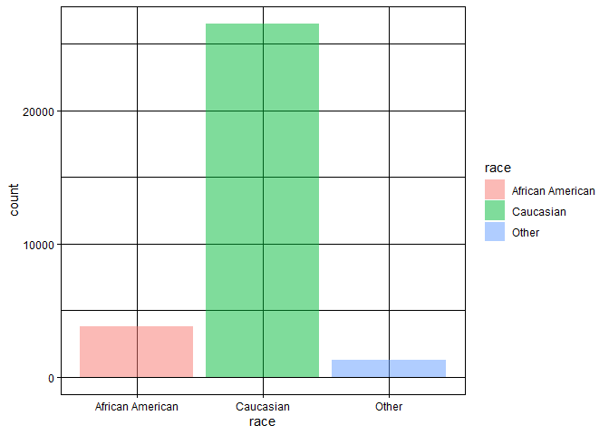
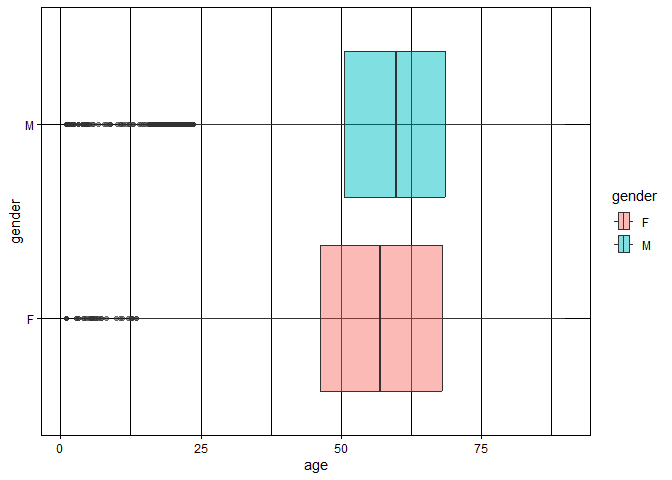
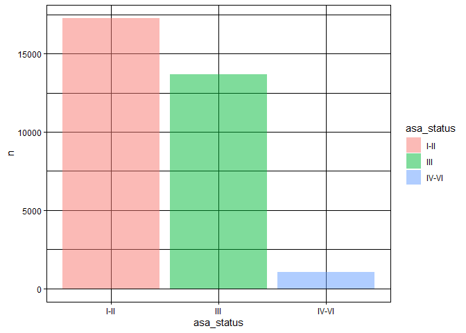
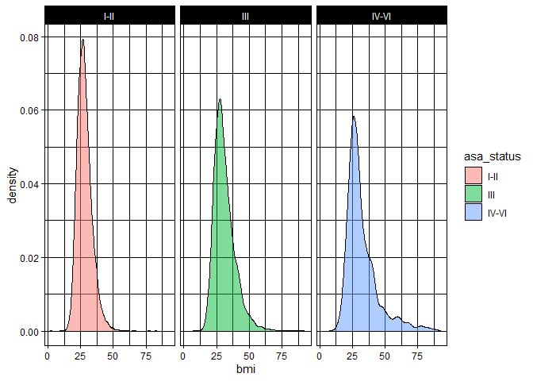
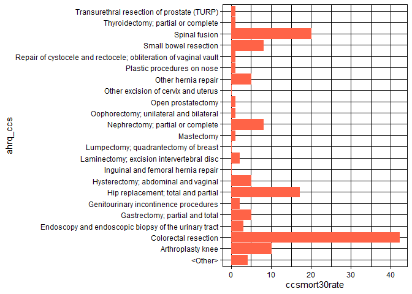
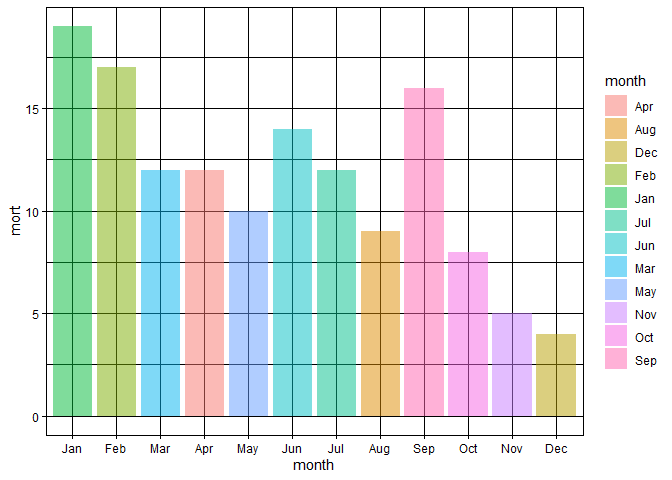

## Instructions
Answer the following questions and complete the exercises in RMarkdown. Please embed all of your code and push your final work to your repository. Your code should be organized, clean, and run free from errors. Remember, you must remove the `#` for any included code chunks to run. Be sure to add your name to the author header above.  

After the first 50 minutes, please upload your code (5 points). During the second 50 minutes, you may get help from each other- but no copy/paste. Upload the last version at the end of this time, but be sure to indicate it as final. If you finish early, you are free to leave.

Make sure to use the formatting conventions of RMarkdown to make your report neat and clean! Use the tidyverse and pipes unless otherwise indicated. To receive full credit, all plots must have clearly labeled axes, a title, and consistent aesthetics. This exam is worth a total of 35 points. 

Please load the following libraries.

```r
library("tidyverse")
library("janitor")
library("naniar")
```

## Data
These data are from a study on surgical residents. The study was originally published by Sessier et al. “Operation Timing and 30-Day Mortality After Elective General Surgery”. Anesth Analg 2011; 113: 1423-8. The data were cleaned for instructional use by Amy S. Nowacki, “Surgery Timing Dataset”, TSHS Resources Portal (2016). Available at https://www.causeweb.org/tshs/surgery-timing/.

Descriptions of the variables and the study are included as pdf's in the data folder.  

Please run the following chunk to import the data.

```r
surgery <- read_csv("data/surgery.csv")
```

1. (2 points) Use the summary function(s) of your choice to explore the data and get an idea of its structure. Please also check for NA's.

```r
glimpse(surgery)
```

```
## Rows: 32,001
## Columns: 25
## $ ahrq_ccs            <chr> "<Other>", "<Other>", "<Other>", "<Other>", "<Othe…
## $ age                 <dbl> 67.8, 39.5, 56.5, 71.0, 56.3, 57.7, 56.6, 64.2, 66…
## $ gender              <chr> "M", "F", "F", "M", "M", "F", "M", "F", "M", "F", …
## $ race                <chr> "Caucasian", "Caucasian", "Caucasian", "Caucasian"…
## $ asa_status          <chr> "I-II", "I-II", "I-II", "III", "I-II", "I-II", "IV…
## $ bmi                 <dbl> 28.04, 37.85, 19.56, 32.22, 24.32, 40.30, 64.57, 4…
## $ baseline_cancer     <chr> "No", "No", "No", "No", "Yes", "No", "No", "No", "…
## $ baseline_cvd        <chr> "Yes", "Yes", "No", "Yes", "No", "Yes", "Yes", "Ye…
## $ baseline_dementia   <chr> "No", "No", "No", "No", "No", "No", "No", "No", "N…
## $ baseline_diabetes   <chr> "No", "No", "No", "No", "No", "No", "Yes", "No", "…
## $ baseline_digestive  <chr> "Yes", "No", "No", "No", "No", "No", "No", "No", "…
## $ baseline_osteoart   <chr> "No", "No", "No", "No", "No", "No", "No", "No", "N…
## $ baseline_psych      <chr> "No", "No", "No", "No", "No", "Yes", "No", "No", "…
## $ baseline_pulmonary  <chr> "No", "No", "No", "No", "No", "No", "No", "No", "N…
## $ baseline_charlson   <dbl> 0, 0, 0, 0, 0, 0, 2, 0, 1, 2, 0, 1, 0, 0, 0, 0, 0,…
## $ mortality_rsi       <dbl> -0.63, -0.63, -0.49, -1.38, 0.00, -0.77, -0.36, -0…
## $ complication_rsi    <dbl> -0.26, -0.26, 0.00, -1.15, 0.00, -0.84, -1.34, 0.0…
## $ ccsmort30rate       <dbl> 0.0042508, 0.0042508, 0.0042508, 0.0042508, 0.0042…
## $ ccscomplicationrate <dbl> 0.07226355, 0.07226355, 0.07226355, 0.07226355, 0.…
## $ hour                <dbl> 9.03, 18.48, 7.88, 8.80, 12.20, 7.67, 9.53, 7.52, …
## $ dow                 <chr> "Mon", "Wed", "Fri", "Wed", "Thu", "Thu", "Tue", "…
## $ month               <chr> "Nov", "Sep", "Aug", "Jun", "Aug", "Dec", "Apr", "…
## $ moonphase           <chr> "Full Moon", "New Moon", "Full Moon", "Last Quarte…
## $ mort30              <chr> "No", "No", "No", "No", "No", "No", "No", "No", "N…
## $ complication        <chr> "No", "No", "No", "No", "No", "No", "No", "Yes", "…
```

```r
names(surgery)
```

```
##  [1] "ahrq_ccs"            "age"                 "gender"             
##  [4] "race"                "asa_status"          "bmi"                
##  [7] "baseline_cancer"     "baseline_cvd"        "baseline_dementia"  
## [10] "baseline_diabetes"   "baseline_digestive"  "baseline_osteoart"  
## [13] "baseline_psych"      "baseline_pulmonary"  "baseline_charlson"  
## [16] "mortality_rsi"       "complication_rsi"    "ccsmort30rate"      
## [19] "ccscomplicationrate" "hour"                "dow"                
## [22] "month"               "moonphase"           "mort30"             
## [25] "complication"
```

```r
anyNA(surgery)
```

```
## [1] TRUE
```


```r
surgery <- read_csv("data/surgery.csv") 
```

```
## Rows: 32001 Columns: 25
## ── Column specification ────────────────────────────────────────────────────────
## Delimiter: ","
## chr (17): ahrq_ccs, gender, race, asa_status, baseline_cancer, baseline_cvd,...
## dbl  (8): age, bmi, baseline_charlson, mortality_rsi, complication_rsi, ccsm...
## 
## ℹ Use `spec()` to retrieve the full column specification for this data.
## ℹ Specify the column types or set `show_col_types = FALSE` to quiet this message.
```

2. (3 points) Let's explore the participants in the study. Show a count of participants by race AND make a plot that visually represents your output.

```r
surgery %>%
  filter(race!="NA") %>% 
  ggplot(aes(x=race, fill=race)) + 
  geom_bar(alpha=0.5)+
  theme_linedraw()
```

<!-- -->

3. (2 points) What is the mean age of participants by gender? (hint: please provide a number for each) Since only three participants do not have gender indicated, remove these participants from the data.

```r
surgery %>% 
  group_by(gender) %>% 
  filter(gender!="NA") %>% 
  summarise(mean_age=mean(age, na.rm=T)) 
```

```
## # A tibble: 2 × 2
##   gender mean_age
##   <chr>     <dbl>
## 1 F          56.7
## 2 M          58.8
```

4. (3 points) Make a plot that shows the range of age associated with gender.

```r
surgery %>%  
  filter(gender!="NA") %>% 
  ggplot(aes(x=age, y=gender, fill=gender)) + 
  geom_boxplot(alpha=0.5)+
  theme_linedraw()
```

```
## Warning: Removed 2 rows containing non-finite values (`stat_boxplot()`).
```

<!-- -->

5. (2 points) How healthy are the participants? The variable `asa_status` is an evaluation of patient physical status prior to surgery. Lower numbers indicate fewer comorbidities (presence of two or more diseases or medical conditions in a patient). Make a plot that compares the number of `asa_status` I-II, III, and IV-V.

```r
surgery %>% 
  filter(asa_status!="NA") %>% 
  count(asa_status) %>% 
  ggplot(aes(x=asa_status, y=n, fill=asa_status)) + 
  geom_col(alpha=0.5)+
  theme_linedraw()
```

<!-- -->

6. (3 points) Create a plot that displays the distribution of body mass index for each `asa_status` as a probability distribution- not a histogram. (hint: use faceting!)

```r
surgery %>% 
  filter(asa_status!="NA") %>% 
  ggplot(aes(x=bmi, fill=asa_status))+
  geom_density(alpha=0.5)+
  facet_grid(.~asa_status)+
  theme_linedraw()
```

```
## Warning: Removed 3289 rows containing non-finite values (`stat_density()`).
```

<!-- -->

The variable `ccsmort30rate` is a measure of the overall 30-day mortality rate associated with each type of operation. The variable `ccscomplicationrate` is a measure of the 30-day in-hospital complication rate. The variable `ahrq_ccs` lists each type of operation.  


7. (4 points) What are the 5 procedures associated with highest risk of 30-day mortality AND how do they compare with the 5 procedures with highest risk of complication? (hint: no need for a plot here)

```r
surgery %>% 
  select(ccsmort30rate, ahrq_ccs)%>%
  group_by(ahrq_ccs) %>% 
  summarise(mean_mort=mean(ccsmort30rate))%>% 
  arrange(-mean_mort) %>% 
  slice_head(n=5)
```

```
## # A tibble: 5 × 2
##   ahrq_ccs                                             mean_mort
##   <chr>                                                    <dbl>
## 1 Colorectal resection                                   0.0167 
## 2 Small bowel resection                                  0.0129 
## 3 Gastrectomy; partial and total                         0.0127 
## 4 Endoscopy and endoscopic biopsy of the urinary tract   0.00811
## 5 Spinal fusion                                          0.00742
```

```r
surgery %>% 
  select(ccscomplicationrate, ahrq_ccs)%>%
  group_by(ahrq_ccs) %>% 
  summarise(mean_com=mean(ccscomplicationrate))%>% 
  arrange(-mean_com)%>% 
  slice_head(n=5)
```

```
## # A tibble: 5 × 2
##   ahrq_ccs                         mean_com
##   <chr>                               <dbl>
## 1 Small bowel resection               0.466
## 2 Colorectal resection                0.312
## 3 Nephrectomy; partial or complete    0.197
## 4 Gastrectomy; partial and total      0.190
## 5 Spinal fusion                       0.183
```

8. (3 points) Make a plot that compares the `ccsmort30rate` for all listed `ahrq_ccs` procedures.

```r
surgery %>% 
  ggplot(aes(x=ahrq_ccs, y= ccsmort30rate)) + 
  geom_col(color="tomato")+
  coord_flip()+
  theme_linedraw()
```

<!-- -->

9. (4 points) When is the best month to have surgery? Make a chart that shows the 30-day mortality and complications for the patients by month. `mort30` is the variable that shows whether or not a patient survived 30 days post-operation.

```r
surgery %>% 
  mutate(mort=ifelse(mort30 == "Yes", 1, 0)) %>% 
  select(month, mort) %>% 
  group_by(month) %>% 
  summarise(mort=sum(mort))
```

```
## # A tibble: 12 × 2
##    month  mort
##    <chr> <dbl>
##  1 Apr      12
##  2 Aug       9
##  3 Dec       4
##  4 Feb      17
##  5 Jan      19
##  6 Jul      12
##  7 Jun      14
##  8 Mar      12
##  9 May      10
## 10 Nov       5
## 11 Oct       8
## 12 Sep      16
```

```r
surgery %>% 
  mutate(com=ifelse(complication == "Yes", 1, 0)) %>% 
  select(month, com) %>% 
  group_by(month) %>% 
  summarise(com=sum(com))
```

```
## # A tibble: 12 × 2
##    month   com
##    <chr> <dbl>
##  1 Apr     321
##  2 Aug     462
##  3 Dec     237
##  4 Feb     343
##  5 Jan     407
##  6 Jul     301
##  7 Jun     410
##  8 Mar     324
##  9 May     333
## 10 Nov     325
## 11 Oct     377
## 12 Sep     424
```

10. (4 points) Make a plot that visualizes the chart from question #9. Make sure that the months are on the x-axis. Do a search online and figure out how to order the months Jan-Dec.

```r
surgery %>% 
  mutate(mort=ifelse(mort30 == "Yes", 1, 0)) %>% 
  select(month, mort) %>% 
  group_by(month) %>% 
  summarise(mort=sum(mort)) %>% 
  ggplot(aes(x=month, y=mort, fill = month))+
  geom_col(alpha=0.5)+
  theme_linedraw()+ scale_x_discrete(limits = month.abb)
```

<!-- -->


```r
surgery %>% 
  mutate(com=ifelse(complication == "Yes", 1, 0)) %>% 
  select(month, com) %>% 
  group_by(month) %>% 
  summarise(com=sum(com))%>% 
  ggplot(aes(x=month, y=com, fill = month))+
  geom_col(alpha=0.5)+
  theme_linedraw()+ scale_x_discrete(limits = month.abb)
```

<!-- -->

Please provide the names of the students you have worked with with during the exam:

Please be 100% sure your exam is saved, knitted, and pushed to your github repository. No need to submit a link on canvas, we will find your exam in your repository.
